<div align="center">


<h1>Service Catalog Specification Platform</h1>

<p><strong>The Strategic Governance Control Plane for Defining, Managing, and Discovering Standardized Service Metadata at Enterprise Scale</strong></p>

[]()
[]()
[]()

<br/>

> **"You cannot manage what you cannot discover."** 
> Service Catalog Spec (Catalog-Spec) is an enterprise-grade platform designed to provide a secure, measurable, and highly automated foundation for global service metadata governance. It orchestrates the complex lifecycle of platform services—from standardized specification definition (YAML/JSON) and schema validation to dependency mapping, ownership enforcement, and auto-generated documentation. By providing a centralized registry with continuous health reporting, compliance heatmaps, and immutable audit logs, it enables organizations to eliminate technical debt, reduce the friction of service discovery, and ensure consistent architectural excellence across every tier of the global infrastructure.

</div>

---

## 🏛️ Executive Summary

Modern microservice architectures have outpaced traditional documentation. Organizations fail to maintain visibility not because of a lack of services, but because of fragmented metadata, unmanaged dependencies, and an inability to discover who owns what across thousands of components.

This platform provides the **Discovery Control Plane**. It implements a complete **Service Intelligence Framework**—from automated spec validation and dependency graph analysis to a specialized lifecycle management engine and auto-generated API documentation. By operationalizing service specifications, it ensures that your services are not just deployed, but continuously indexed for discovery, validated for compliance, and governed with strategic precision.

---

## 🏛️ Core Catalog Pillars

1. **Unified Service Registry**: Centralized hub for registering and discovering services across infrastructure, applications, and platform tiers.
2. **High-Fidelity Spec Validation**: Automated assessment of service definitions against strict schemas and organizational governance policies.
3. **Advanced Dependency Mapping**: Graph-based analysis of service interconnections, facilitating impact analysis and architectural reviews.
4. **Lifecycle Governance Engine**: Standardized workflow for managing the birth, growth, deprecation, and retirement of platform services.
5. **Auto-Generated Documentation**: Continuous generation of READMEs, API docs, and metadata reports from single-source-of-truth specifications.
6. **Immutable Governance Audit**: Comprehensive logging of every spec update, approval workflow, and ownership change for organizational transparency.

---

## 📐 Architecture Storytelling: 50+ Advanced Diagrams

### 1. The Service Specification Lifecycle
*The flow from definition to retirement.*
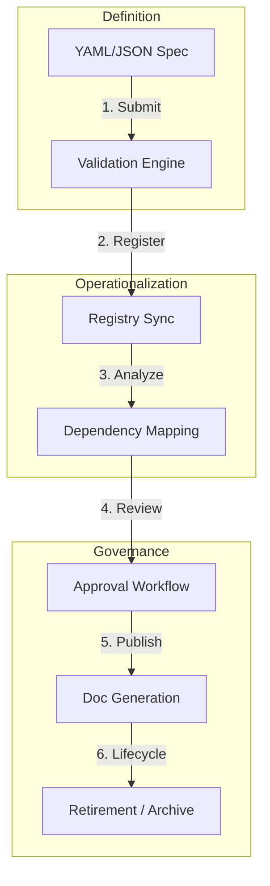

### 2. Dependency Graph Topology
*Visualizing the interconnected web of services.*
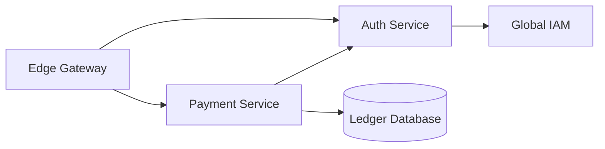

### 3. Spec Validation Logic Flow
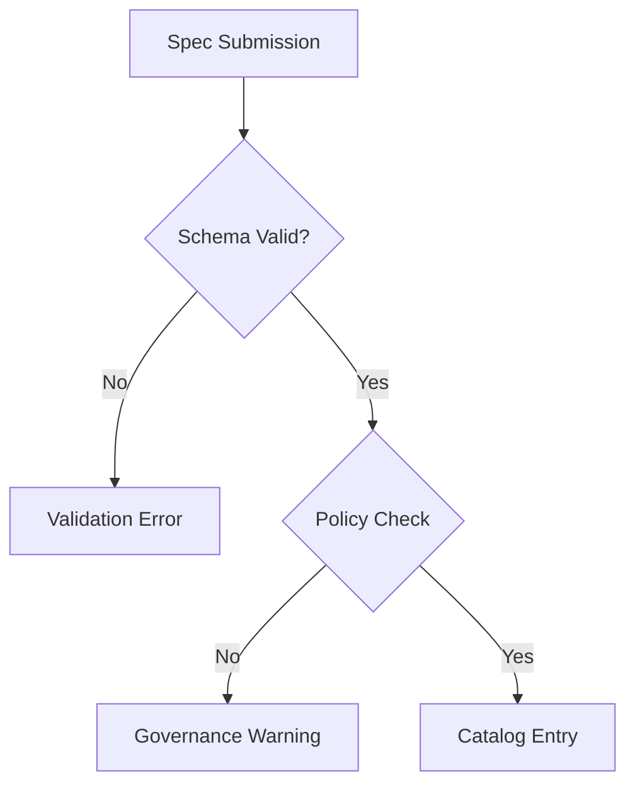

### 4. Service Metadata Hub Model
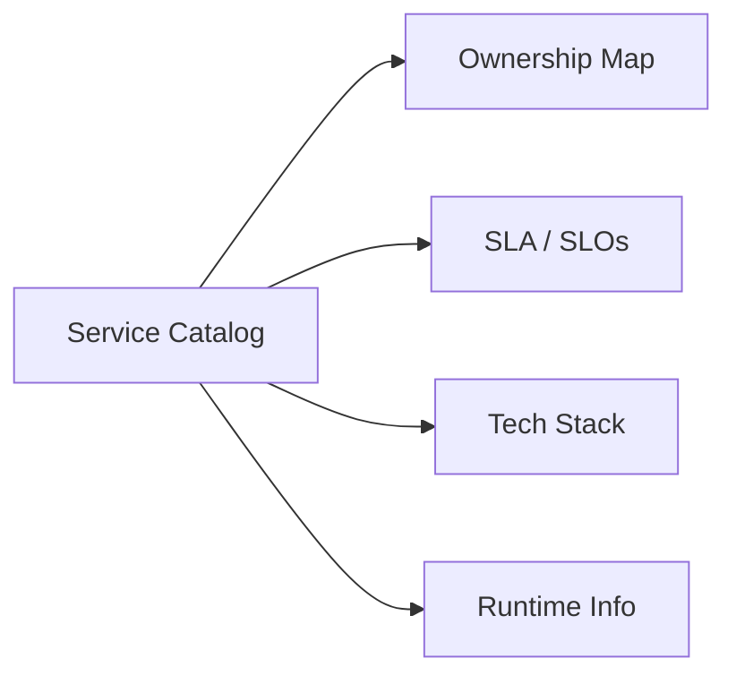

### 5. Deployment Topology: High-Available Registry Hub
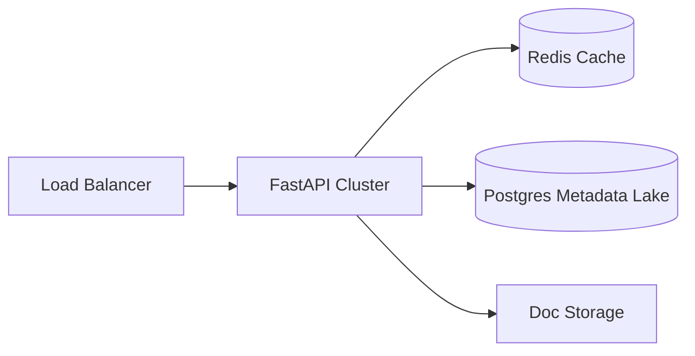

### 6. Lifecycle State Machine
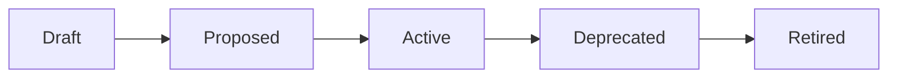

### 7. Foundation: Multi-Environment Setup
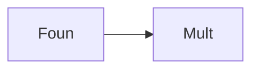

### 8. Networking: Secure Catalog Tunnels
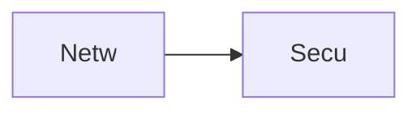

### 9. Component: Catalog Engine
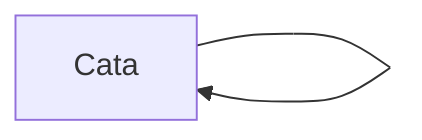

### 10. Component: Validation Engine
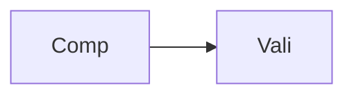

### 11. Component: Dependency Mapper
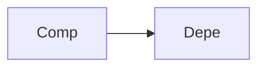

### 12. Component: Lifecycle Engine
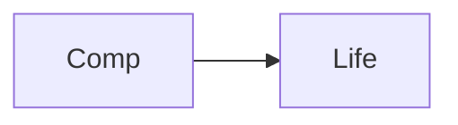

### 13. Logic: Spec Parser
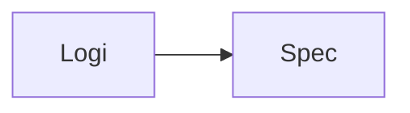

### 14. Logic: Graph Resolver
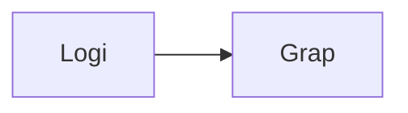

### 15. Logic: Policy Evaluator
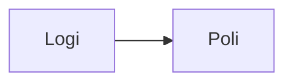

### 16. Logic: Documentation Transformer
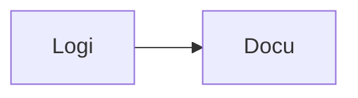

### 17. Architecture: Central Metadata Hub
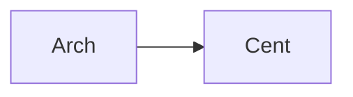

### 18. Architecture: Event-Driven Discovery
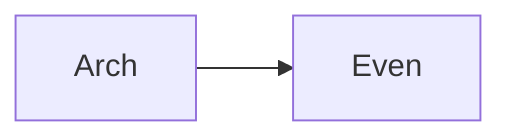

### 19. Architecture: Multi-Source Registry
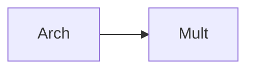

### 20. Pattern: Service-as-Code
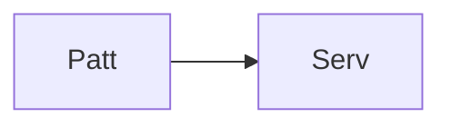

### 21. Pattern: Automated Discovery
```mermaid
graph LR
    P[Patt] --> A[Auto]
```

### 22. Pattern: Zero-Trust Registry
```mermaid
graph LR
    P[Patt] --> Z[Zero]
```

### 23. Security: Signed Service Specs
```mermaid
graph LR
    S[Secu] --> S[Sign]
```

### 24. Security: Validation Integrity
```mermaid
graph LR
    S[Secu] --> V[Vali]
```

### 25. Security: Secure Audit Record
```mermaid
graph LR
    S[Secu] --> S[Secu]
```

### 26. Feature: Service Version Diff
```mermaid
graph LR
    F[Feat] --> S[Serv]
```

### 27. Feature: Dependency Impact Visualizer
```mermaid
graph LR
    F[Feat] --> D[Depe]
```

### 28. Feature: Auto-generated README
```mermaid
graph LR
    F[Feat] --> A[Auto]
```

### 29. Compliance: ISO 27001 Asset Inventory
```mermaid
graph LR
    C[Comp] --> I[ISO]
```

### 30. Compliance: GDPR Data Mapping
```mermaid
graph LR
    C[Comp] --> G[GDPR]
```

### 31. Infrastructure: Redis Registry Cache
```mermaid
graph LR
    I[Infr] --> R[Redi]
```

### 32. Infrastructure: Postgres Metadata DB
```mermaid
graph LR
    I[Infr] --> P[Post]
```

### 33. Deployment: Kubernetes Catalog Pods
```mermaid
graph LR
    D[Depl] --> K[Kube]
```

### 34. Deployment: Multi-Region Registry Sync
```mermaid
graph LR
    D[Depl] --> M[Mult]
```

### 35. Monitoring: Registration Success KPI
```mermaid
graph LR
    M[Moni] --> R[Regi]
```

### 36. Monitoring: Validation Latency
```mermaid
graph LR
    M[Moni] --> V[Vali]
```

### 37. UI: Catalog Hub View
```mermaid
graph LR
    U[UI] --> C[Cata]
```

### 38. UI: Dependency Graph Pane
```mermaid
graph LR
    U[UI] --> D[Depe]
```

### 39. UI: Spec Editor & Preview
```mermaid
graph LR
    U[UI] --> S[Spec]
```

### 40. UI: Governance Approval Dashboard
```mermaid
graph LR
    U[UI] --> G[Gove]
```

### 41. CI/CD: Spec validation pipeline
```mermaid
graph LR
    C[CICD] --> S[Spec]
```

### 42. CI/CD: Documentation build pipeline
```mermaid
graph LR
    C[CICD] --> D[Docu]
```

### 43. Strategy: Documentation-as-Code
```mermaid
graph LR
    S[Stra] --> D[Docu]
```

### 44. Strategy: Single Source of Truth
```mermaid
graph LR
    S[Stra] --> S[Sing]
```

### 45. Feature: Auto-generated API Client
```mermaid
graph LR
    F[Feat] --> A[Auto]
```

### 46. Feature: Service Health Overlay
```mermaid
graph LR
    F[Feat] --> S[Serv]
```

### 47. Feature: Governance Scorecard
```mermaid
graph LR
    F[Feat] --> G[Gove]
```

### 48. Logic: Reference Resolver
```mermaid
graph LR
    L[Logi] --> R[Refe]
```

### 49. Data Model: Service Entity
```mermaid
graph LR
    D[Data] --> S[Serv]
```

### 50. Enterprise Catalog Excellence
```mermaid
graph LR
    E[Entr] --> C[Cata]
```

---

## 🛠️ Technical Stack & Implementation

### Catalog Engine & APIs
- **Framework**: Python 3.11+ / FastAPI.
- **Spec Engine**: JSON/YAML parser with versioned schema enforcement.
- **Validation Engine**: Policy-as-Code rules for metadata completeness and ownership.
- **Dependency Engine**: Graph-based resolver for impact analysis.
- **Cache**: Redis for high-speed registry lookup and discovery metadata.
- **Persistence**: PostgreSQL for service definitions, relationships, and audit trails.
- **Identity**: OIDC / JWT with RBAC for granular catalog management access.

### Frontend (Catalog Dashboard)
- **Framework**: React 18 / Vite.
- **Theme**: Indigo / Slate (Modern Platform Engineering aesthetic).
- **Visualization**: Recharts for growth metrics and D3/Vis for dependency graphs.

### Infrastructure
- **Runtime**: AWS EKS (Kubernetes).
- **Deployment**: Helm charts for engines and registry workers.
- **IaC**: Terraform (Modular with Catalog focus).

---

## 🚀 Deployment Guide

### Local Development
```bash
# Clone the repository
git clone https://github.com/devopstrio/service-catalog-spec.git
cd service-catalog-spec

# Setup environment
cp .env.example .env

# Launch the Catalog stack (API, Workers, DB, Redis, UI)
make up

# Run a sample spec validation simulation
make validate-spec

# Auto-generate service documentation
make generate-docs
```
Access the Service Catalog Dashboard at `http://localhost:3000`.

---

## 📜 License
Distributed under the MIT License. See `LICENSE` for more information.
