<div align="center">


<h1>Service Catalog Specification Platform</h1>

<p><strong>The Strategic Governance Control Plane for Defining, Managing, and Discovering Standardized Service Metadata at Enterprise Scale.</strong></p>

[]()
[]()
[]()

<br/>

> **"You cannot manage what you cannot discover."** 
> **Service Catalog Spec (Catalog-Spec)** is an enterprise-grade platform designed to provide a secure, measurable, and highly automated foundation for global service metadata governance. It orchestrates the entire lifecycle—from standardized specification definition and schema validation to dependency mapping, ownership enforcement, and auto-generated documentation.

</div>

---

## 🏛️ Executive Summary

Modern microservice architectures have outpaced traditional documentation methods. Organizations often fail to maintain visibility not because of a lack of services, but because of fragmented metadata and an inability to discover who owns what across thousands of ephemeral components and cloud resources.

This platform provides the **Discovery Control Plane**. It implements a complete **Service Intelligence Framework**, enabling Platform Engineering teams to manage service metadata as a first-class citizen. By automating the validation of service specifications and the generation of dependency graphs, we ensure that every organizational asset is indexed for discovery, validated for compliance, and governed with strategic precision.

---

## 📐 Architecture Storytelling: Principal Reference Models

### 1. Principal Architecture: Global Service Metadata & Catalog Orchestration Plane
This diagram illustrates the end-to-end flow from GitOps-driven specification commits to multi-source discovery, automated validation, and institutional service search.

```mermaid
graph LR
    %% Subgraph Definitions
    subgraph SpecIngestion["Specification Ingestion Hub"]
        direction TB
        YAML["Service YAML (Catalog-as-Code)"]
        Git["Git Repository (GitHub/GitLab)"]
        CLI["Catalog CLI (Validation)"]
    end

    subgraph IntelligenceEngine["Catalog Intelligence Hub"]
        direction TB
        API["FastAPI Metadata Gateway"]
        Validator["Schema & Policy Validator"]
        Graph["Dependency Graph Resolver"]
        Inventory["Global Service Registry"]
    end

    subgraph DiscoveryPlane["Multi-Source Discovery Hub"]
        direction TB
        K8s["Kubernetes Discovery (Pods/CRDs)"]
        Cloud["Cloud Discovery (AWS/Azure/GCP)"]
        Repo["Repo Discovery (Languages/Tags)"]
    end

    subgraph UserInterface["Institutional Discovery UI"]
        direction TB
        Search["Advanced Service Search"]
        Scorecard["Tech-Health Scorecards"]
        Docs["Auto-Generated API Documentation"]
    end

    subgraph DevOps["Governance & Audit Orchestration"]
        direction TB
        RBAC["IAM & Ownership Governance"]
        TF["Terraform Catalog Modules"]
        Lake["Forensic Metadata Lake"]
    end

    %% Flow Arrows
    SpecIngestion -->|1. Commit Spec| API
    DiscoveryPlane -->|2. Detect Resources| API
    API -->|3. Validate Schema| Validator
    Validator -->|4. Resolve Deps| Graph
    Graph -->|5. Index Service| Inventory
    
    Inventory -->|6. Search & Find| Search
    Inventory -->|7. Generate Score| Scorecard
    Inventory -->|8. Render| Docs
    
    RBAC -->|9. Enforce Ownership| Inventory
    TF -->|10. Provision Hub| IntelligenceEngine
    API -->|11. Record Evolution| Lake

    %% Styling
    classDef ingestion fill:#f5f5f5,stroke:#616161,stroke-width:2px;
    classDef intel fill:#ede7f6,stroke:#311b92,stroke-width:2px;
    classDef discovery fill:#e3f2fd,stroke:#0d47a1,stroke-width:2px;
    classDef ui fill:#e8f5e9,stroke:#1b5e20,stroke-width:2px;
    classDef devops fill:#fffde7,stroke:#f57f17,stroke-width:2px;

    class SpecIngestion ingestion;
    class IntelligenceEngine intel;
    class DiscoveryPlane discovery;
    class UserInterface ui;
    class DevOps devops;
```

### 2. The Catalog-as-Code Lifecycle Management Flow
The continuous path of a service record from initial YAML definition to long-term lifecycle retirement.

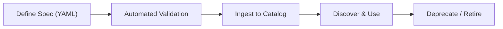

### 3. Service Metadata Taxonomy & Entity Model
Standardizing how systems, components, and APIs are related within the organizational graph.

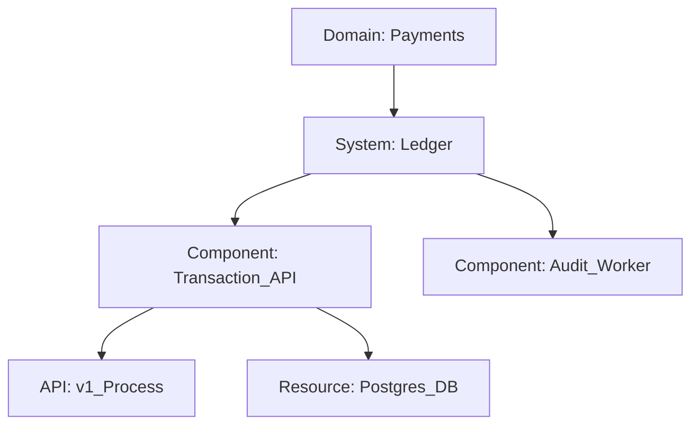

### 4. Institutional Ownership & Dependency Graph
Mapping technical dependencies directly to organizational teams to eliminate "ownership orphans".

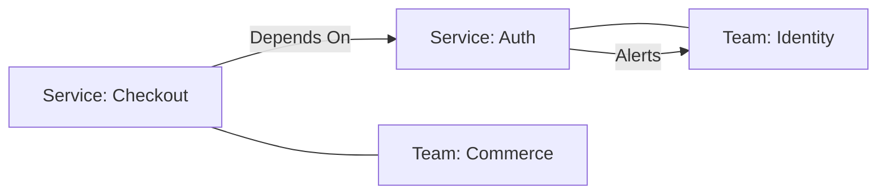

### 5. Multi-Source Discovery & Ingestion Hub
Automated detection of services across diverse infrastructure and application landscapes.

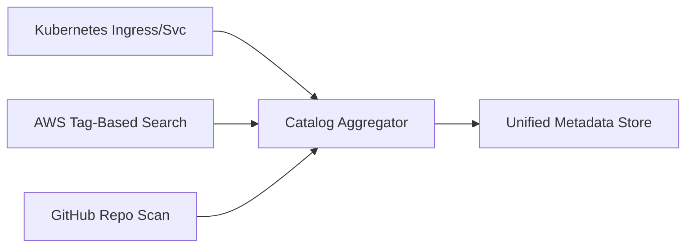

### 6. Spec Validation & Governance Guardrails
Ensuring every service record meets the institutional requirements for documentation and security.

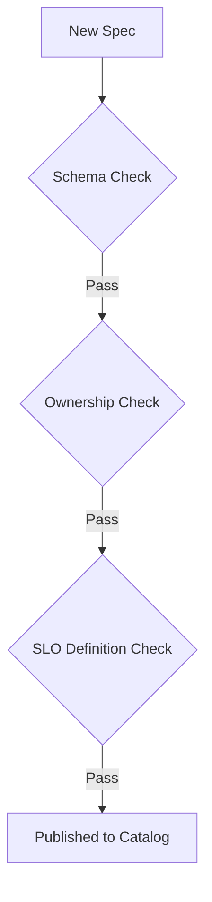

### 7. Institutional Search & Discovery Engine
Providing a centralized portal for developers to find approved APIs, documentation, and tools.

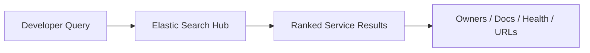

### 8. Identity & RBAC for Catalog Governance
Managing who has the authority to edit service metadata and approve new domains.

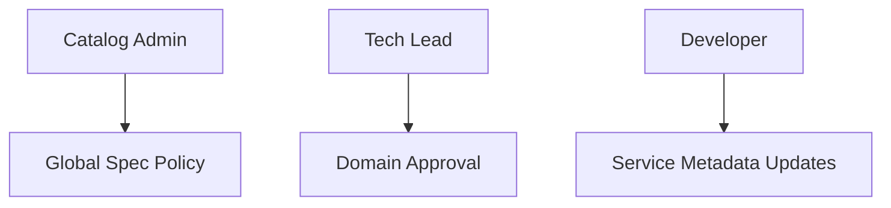

### 9. Tech-Health Scorecard & Maturity Model
Measuring every service against key platform indicators to drive architectural excellence.

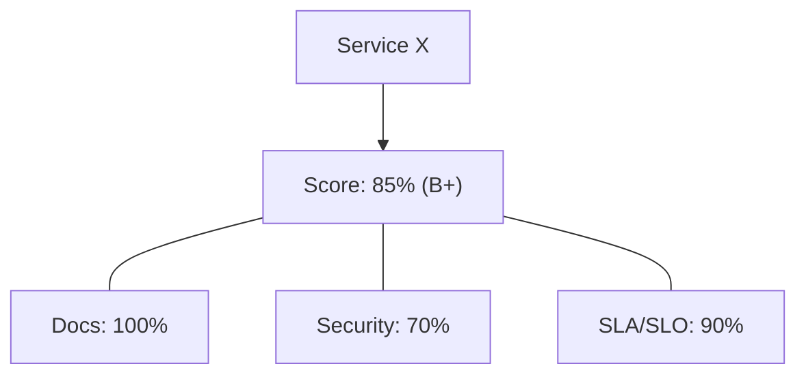

### 10. IaC Deployment: Catalog-as-Code Framework
Using Terraform to manage the configuration and deployment of the service catalog platform.

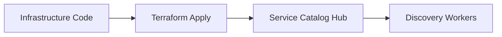

### 11. Metadata Lake for Forensic Service Audit
Storing long-term records of service evolution, ownership changes, and version history.

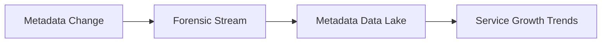

---

## 🏛️ Core Catalog Pillars

1.  **Unified Service Registry**: Centralized hub for registering and discovering services across infrastructure and applications.
2.  **High-Fidelity Spec Validation**: Automated assessment of service definitions against schemas and governance policies.
3.  **Advanced Dependency Mapping**: Graph-based analysis of service interconnections for impact analysis.
4.  **Lifecycle Governance Engine**: Standardized workflow for managing the birth, growth, and retirement of platform services.
5.  **Auto-Generated Documentation**: Continuous generation of READMEs and API docs from single-source-of-truth specs.
6.  **Immutable Governance Audit**: Comprehensive logging of every spec update and ownership change for transparency.

---

## 🛠️ Technical Stack & Implementation

### Catalog Engine & APIs
*   **Framework**: Python 3.11+ / FastAPI.
*   **Spec Engine**: JSON/YAML parser with versioned schema enforcement for service metadata.
*   **Validation Engine**: Policy-as-Code rules for metadata completeness and ownership verification.
*   **Dependency Engine**: Graph-based resolver for impact analysis and architectural visualization.
*   **State Management**: PostgreSQL (Metadata Lake) and Redis (Search Cache).

### Catalog Dashboard (UI)
*   **Framework**: React 18 / Vite.
*   **Theme**: Indigo / Slate (Modern Platform Engineering aesthetic).
*   **Visualization**: D3.js and Vis.js for complex dependency graph rendering.

### Infrastructure & DevOps
*   **Runtime**: AWS EKS or Azure Kubernetes Service (AKS).
*   **IaC**: Modular Terraform for deploying the catalog hub and discovery workers.

---

## 🏗️ IaC Mapping (Module Structure)

| Module | Purpose | Real Services |
| :--- | :--- | :--- |
| **`infrastructure/catalog`** | Central management plane | EKS, PostgreSQL, Redis |
| **`infrastructure/discovery`** | Multi-source discovery agents | Lambda, EventBridge, CloudTrail |
| **`infrastructure/auth`** | Identity and ownership RBAC | Azure AD, Okta, Keycloak |
| **`infrastructure/storage`** | Documentation and artifact sinks | S3, ElasticSearch, GCS |

---

## 🚀 Deployment Guide

### Local Principal Environment
```bash
# Clone the catalog platform
git clone https://github.com/devopstrio/service-catalog-spec.git
cd service-catalog-spec

# Configure environment
cp .env.example .env

# Launch the Catalog stack
make up

# Run a sample spec validation simulation
make validate-spec

# Auto-generate service documentation
make generate-docs
```

Access the Service Catalog Dashboard at `http://localhost:3000`.

---

## 📜 License
Distributed under the MIT License. See `LICENSE` for more information.

---
<div align="center">
  <p>© 2026 Devopstrio. All rights reserved.</p>
</div>
